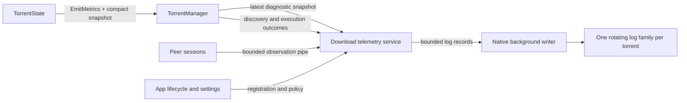

# Per-torrent Download Diagnostics Plan

Status: proposed implementation; no runtime changes implemented by this document.

## Purpose and agreed behavior

Create an independent diagnostic log for each downloading torrent that captures
the lead-up to slowdowns and stalls without requiring a full protocol trace.

- Default to **Debug during metadata acquisition and active downloading**.
- Suspend collection on pause or, under downloads-only scope, entry into seeding,
  after a final summary.
- Resume collection when downloading resumes or wanted data becomes incomplete.
- Support Off, Summary, Debug, and Trace, with global defaults and per-torrent
  overrides. Detail and activity scope are separate settings.
- Offer an explicit `always` scope for diagnostics while seeding. Pause still
  suspends periodic collection; lifecycle/configuration records remain possible.
- Keep changes to `TorrentState` limited to producing a compact snapshot through
  its existing metrics effect. Sessions send observations directly to telemetry.
- Enforce bounds on producer work, queues, retained history, files, and total
  storage. Diagnostic failures must not block or change download behavior.

Debug means a deliberately selected set of diagnostic records. It does not turn
on all existing `tracing::debug!` calls. General application logging retains its
own configuration and remains available when torrent diagnostics are disabled.

## Current integration points

| Existing code | Relevance |
| --- | --- |
| `src/torrent_manager/state.rs` | `Effect::EmitMetrics` is emitted on ticks and lifecycle paths. State already owns peer flags, assigned work, piece queues, verification/write sets, and transfer totals. |
| `src/torrent_manager/manager.rs` | Executes effects and builds `TorrentMetrics`; can forward diagnostic snapshots before UI telemetry filtering. |
| `src/telemetry/manager_telemetry.rs` | Filters unchanged UI snapshots. Keep this behavior separate from diagnostic sampling. |
| `src/app/torrent_model.rs` | Existing `TorrentMetrics` is a presentation snapshot, with source/path fields and potentially large peer data. Do not serialize it wholesale into diagnostics. |
| `src/networking/session.rs` | Knows request-window capacity, queued work, writer waits, received responses, and session termination. |
| `src/networking/protocol.rs` | Confirm the actual writer completion boundary here when instrumenting dispatch; enqueueing a request is not a socket write. |
| `src/app/native/torrent_runtime.rs`, `src/app/native/runtime.rs` | Manager registration, replacement, shutdown, and application service ownership. |
| `src/app/manager_lifetime.rs` | Existing stale-observation protection to follow when identifying manager incarnations. |
| `src/native/logging.rs` | Existing background writer pattern; daily rotation and silent queue drops do not satisfy the new size/loss requirements. |
| `src/config/mod.rs`, `src/config/native.rs` | Settings defaults, persistence, host configuration, and runtime log directory resolution. |

The UI uses a latest-value `watch` channel, which can skip intermediate updates.
Diagnostic events need their own bounded pipe. Periodic summaries must continue
when UI metrics are unchanged, including during a stall.

## Data flow and ownership



The app owns a long-lived telemetry service and writer, independent of UI drawing.
Telemetry owns per-torrent aggregation, sample history, activity gating, stall
observation, and output frequency. The writer owns serialization, files, quotas,
rotation, and flushing. Avoid a task or writer thread per peer or torrent.

Proposed shared types belong in a new `src/telemetry/download_diagnostics.rs`
(split into a module directory if needed). Proposed native storage code belongs
in `src/native/torrent_diagnostics.rs`. These names are implementation proposals.

### Minimal state changes

1. Add a `StateDownloadSnapshot` type and one read-only helper on `TorrentState`.
2. Add the snapshot to `Effect::EmitMetrics` and populate every construction site,
   including tick, pause, delete, and shutdown paths.
3. Forward that snapshot from TorrentManager before `ManagerTelemetry` decides
   whether to publish UI metrics.

State gains no diagnostic accumulator, logger, sender, configuration, retention
buffer, stall detector, or new per-block action. The helper uses existing fields.
Where a value cannot be obtained cheaply, leave it unavailable in the first
version rather than adding expensive scans or new state bookkeeping.

Snapshot fields should cover:

- Lifecycle facts: metadata availability, status, pause, data availability, and
  known completion facts. Preserve unknown values during metadata acquisition.
- Existing cumulative transfer totals and the interval byte counts already
  carried by the effect; label units explicitly.
- Registered versus successfully connected peer counts, choke/interest counts,
  and transport counts where available.
- Assigned outstanding work, needed/pending queue sizes, and verification/write
  backlog sizes. Define whether each count measures pieces, blocks, or peers.
- Cheap existing progress totals; reuse manager-side progress calculations for
  fields that would otherwise require another full piece scan.

Existing state transfer counters increment before block deduplication and can
include duplicate blocks for unfinished pieces. Label them as existing transfer
accounting, not unique accepted bytes. They cannot establish useful progress or
successful recovery. Keep received payload, unique accepted data (when actually
observable), verified pieces, and committed pieces as distinct signals.

Bound construction to existing collection lengths and, at most, one peer pass.
Do not clone bitfields, peer lists, tracker URLs, or file manifests. Do not scan
every peer's pieces to calculate exact wanted-piece availability on every tick.
The no-op/disabled path should avoid the optional peer pass without adding
diagnostic policy to state; a first cut can keep the state snapshot to cheap
scalars and collect peer aggregates in the gated manager adapter.

Lifecycle snapshots describe state at their construction point. Some existing
pause/delete paths have already cleared peers or reset counters at that point.
Telemetry must retain the previous snapshot and interpret terminal resets as
resets, not negative throughput. Capture manager lifecycle context before
destructive transitions when needed; do not reorder download cleanup for logging.

### Session and manager observations

Give each session a cloneable `TorrentDiagnosticHandle` with stable torrent,
process run, manager incarnation, and session identity, plus access to shared
current collection policy. The shared policy includes enabled detail, activity
scope, and collection epoch. It provides a cheap `enabled(level)` check and
nonblocking observation submission.

Read a coherent policy/epoch value when emitting each observation; do not freeze
the epoch when constructing the session. Submission must recheck admission so a
concurrent disable cannot admit new records into a closing epoch. Sessions that
survive seeding or a detail change adopt the current policy without restarting.
Manager replacement permanently invalidates the old handle's incarnation.
Operations spanning a disabled interval report that collection gap; they must
not relabel old buffered observations or infer unseen activity in the new epoch.

Debug observations include session start/end, typed failure reason, transport,
prolonged request-capacity waits, and recovery from those waits. Routine activity
uses counters or periodic compact observations, not one pipe message per block.
Check enabled state before constructing messages or doing diagnostic-only work.

Distinguish the request stages explicitly: assigned by manager, waiting for a
window permit, queued to writer, written to transport, and response received.
Only report a stage when its owning code observes it. A successful channel send
does not establish that a request reached the network.

Report session endings at the actual termination boundary, with one owner for
the terminal record. Cancellation, remote EOF, protocol error, timeout, and
administrative shutdown are distinct outcomes. Include unavailable/unknown
reasons honestly. Avoid counting both a guard cleanup and the task result as two
disconnects. Preserve network generation identity when applicable.

TorrentManager can additionally report existing tracker/DHT results, connection
attempt outcomes, command queue rejection, verification results, and storage
errors at their execution boundaries. Add these incrementally without changing
`Action` variants throughout state merely to carry diagnostic data.

### Pipe and aggregation contract

- Snapshots are replaceable latest values per registered torrent; include source
  time and sequence. Events use a bounded queue and may be dropped under pressure.
- Use cumulative counters within an incarnation where totals must survive missed
  observations. Mark differences as unavailable across resets or collection gaps.
- Bound per-peer aggregation and histories. Evict departed peers; aggregate
  overflow into fixed reason buckets rather than retaining unlimited identifiers.
- Rate-limit before enqueueing, including under Trace. Bound record size and
  account for both per-torrent traffic and total process traffic.
- Track producer suppression, queue drops, stale-epoch rejection, serialization
  truncation, and writer failures separately. Loss accounting must survive a full
  event queue and appear in a later summary or service health report.
- Share timestamp conventions and identifiers across both inputs. Preserve source
  timestamps and per-source sequence; collector order alone is not causal order.
- Collector timers remain independent of manager progress. If snapshots stop,
  report stale telemetry with its age rather than repeatedly claiming old peer
  state is current or calling it a confirmed network stall.

## Detail levels and activation

| Detail | Records |
| --- | --- |
| Off | No per-torrent collection or files; ordinary application errors still work. |
| Summary | Periodic compact snapshots, lifecycle transitions, stall/recovery, loss accounting, and significant torrent errors. |
| Debug (default) | Summary plus bounded session details, wait observations, discovery/execution outcomes, and repeated-event aggregates. |
| Trace (explicit) | Debug plus selected individual request, cancellation, and protocol transitions. Never payload bytes or raw message dumps. |

Global policy supplies defaults; explicit per-torrent values override only the
specified fields. A temporary Trace override has the highest precedence, expires
using monotonic time, and restores the prior policy. Propose a five-minute default
duration for temporary Trace. Persistent Trace must be an explicit setting.

Persist permanent configuration using existing settings/catalog ownership; keep
temporary overrides in memory. Missing fields in older configs receive the new
defaults. Expose effective detail, scope, expiry, log location, and dropped counts
through existing status/settings surfaces. Configuration names and CLI syntax
must be finalized during implementation and documented as implemented then.

Downloads-only activation includes metadata acquisition and incomplete wanted
data. Use the engine's authoritative completion/selection policy rather than
assuming every manifest file must be downloaded. Validation gets explicit phase
context and must not be classified as a network stall. Paused/removed torrents
are inactive. `always` keeps seeding diagnostics active, but does not run a
download-stall detector while seeding.

On completion with `always` scope, record the download-to-seeding transition and
final download summary, clear download-stall tracking, and continue collection
and file output in the same epoch. Downloads-only scope instead closes collection
as described below. A later transition back to downloading reinitializes detector
baselines under either scope.

On pause, downloads-only completion, disable, replacement, or removal:

1. Close producer admission and mark the epoch as draining. Establish an admission
   cutoff: records accepted before it remain eligible for draining; submissions
   after it are rejected and counted. App control intent takes precedence over
   queued snapshots. Neither queued records nor snapshots may reactivate an epoch.
2. Drain accepted records to that cutoff within a bounded deadline. Account for
   records abandoned at the deadline, then mark the epoch closed. A simple
   "reject every noncurrent epoch" filter must not discard this accepted tail.
3. Emit the terminal summary, request a bounded flush, and close the file when
   storage responds. Apply the worker timeout policy below if it does not.
4. Preserve files according to retention policy. Resume publishes a new enabled
   epoch through shared policy; manager replacement also gets a new incarnation.

Keep the lightweight lifecycle/control observation path active while diagnostic
collection is disabled so incomplete wanted data can reactivate downloads-only
collection. This does not require emitting periodic seeding log records.

The lifecycle/control path must not compete with a saturated Trace queue.
Provide reserved control capacity or an independently observed registration
state. Stop producers before stopping telemetry, and telemetry before the writer.
Process crashes can lose buffered tail records; logs are best-effort diagnostics.

## Sampling and stall behavior

These numeric values are proposed initial defaults, subject to load measurements:

| Condition | Output |
| --- | --- |
| Normal active download | One compact snapshot every 15 seconds. |
| Suspected stall | Immediate snapshot and recent history, then every 5 seconds for up to two minutes. |
| Same prolonged stall | One summary every 30 seconds; aggregate repeating details. |
| Recovery | One recovery record, then normal frequency after hysteresis. |
| Repeated Debug events | At most 10 detailed examples per torrent per minute, with counts for suppressed repetitions. |

Keep a fixed recent-history ring, initially up to 24 samples taken at five-second
intervals, to retain approximately two minutes before the detected stall. Bound
both per-torrent and total history memory. Replayed history carries original
timestamps and sample IDs so readers can distinguish it from new observations.

The first detector covers **no received payload**, not every form of stalled
useful progress. Its initial threshold is 30 seconds without a received payload
observation while wanted data remains, downloading is allowed, and observations
are fresh. Use a session receive counter/timestamp summarized at bounded cadence,
not state transfer totals interpreted as unique bytes. Missing observations or
collection gaps produce unknown/stale status rather than proving inactivity.

Record `suspected_stall` with reason `no_payload_received`, not a proven cause.
Describe observed conditions such as no connected peers, remote choking,
unanswered dispatched requests, or local capacity waits. Keep metadata
acquisition, validation, and storage/verification waits as distinct phases.
Track payload activity, verification, and committed progress separately;
completion of a large piece is not required to establish network activity.

Clear the no-payload episode after fresh receive-counter increases in two
consecutive five-second sampling intervals, independently of log-write frequency.
Label this `payload_resumed`; it does not establish useful download progress.
Repeated duplicate or corrupt data may restore payload activity while verified
or committed progress remains unchanged. Preserve those facts in the summary.

Detecting no unique accepted progress requires a qualified signal from the actual
block-acceptance boundary; it is deferred rather than adding state bookkeeping
to this first implementation. Also defer automatic low-rate detection until a
baseline and rate-limit-aware rule are qualified. Default Debug still captures
evidence for these cases. Never enable Trace automatically on a detected stall.

## Files and resource budgets

Write newline-delimited structured JSON under the resolved host runtime log root:

```text
<runtime-log-dir>/torrents/<info-hash>.jsonl
<runtime-log-dir>/torrents/<info-hash>.1.jsonl
<runtime-log-dir>/torrents/<info-hash>.2.jsonl
```

Use canonical torrent identity, not a torrent title, for filenames. Follow shared
mode's host log ownership and ensure one writer owns each file family; concurrent
processes require separate run directories or an ownership mechanism. Do not
write a single shared cluster file from multiple hosts.

Every record includes schema version, build/version, torrent identity, run and
incarnation identity, collection epoch, timestamp, level, and event kind. Session
records also include session/transport identity. Use explicit byte/bit units.
Prefer session IDs over raw endpoints in default records. Exclude magnet links,
tracker credentials/query strings, payloads, and full source/download paths at
every level. Sanitize and bound external error text before enqueueing.

Proposed initial native budgets:

| Resource | Bound |
| --- | --- |
| File segment | 2 MiB; rotate before a record would exceed the limit. |
| Retained segments | Three per torrent, including the current segment. |
| Total diagnostic files | 128 MiB per host runtime log root. |
| File age | Seven days; prune on startup and periodically. |
| Encoded record | 4 KiB, with an explicit truncation marker where applicable. |
| Open files | 32, with flush/close/reopen through an LRU cache. |
| Recent-history memory | 8 MiB globally, including bounded entry overhead. |
| Pipe and pending record memory | 8 MiB globally across collection and writing, including envelope overhead. |

Choose queue capacities and Trace event admission rates from measured record
sizes within these budgets before enabling defaults. Enforce per-torrent fairness
so one Trace torrent cannot consume all capacity or suppress other summaries.

Prune oldest eligible segments first. If active torrents exhaust the global
budget, recycle older diagnostic segments or suspend admission with a visible
quota state; active status cannot bypass the global cap. Publish eviction counts.
Logging disable/delete operations must only affect service-owned diagnostic files.

Flush periodically and at rotation/closure, not for each protocol event. File
errors enter bounded retry/backoff and a rate-limited application warning; stop
admission when the writer is unhealthy rather than building an unlimited backlog.
Use a dedicated writer thread with a shutdown acknowledgement. App shutdown waits
for that acknowledgement only until a fixed deadline (initially two seconds).
Request shutdown through an independent flag/control path that cannot block on a
full data queue. Join only after the worker has finished; never perform an
unconditional join or blocking send in the guard's destructor.

At the deadline, report an incomplete flush through available service health or
application logging and abandon the wait, accepting loss of the buffered tail.
Blocking filesystem calls cannot be cancelled by an async timeout: the worker
may remain blocked until the OS returns or the process exits. Do not spawn
replacement writers or reuse its files while it still owns them. The guarantee
is bounded application waiting, not forced completion or cancellation of disk I/O.

## Platform scope

Implement shared observation types, gating, and aggregation without filesystem
dependencies. Initial persistent files are a native capability. Browser builds
use a disabled sink unless a bounded browser capture/export capability is
explicitly implemented; they must not silently claim native file logging works.
Update all manager/session constructors and feature combinations for the handle.
TCP/uTP and supported WebRTC/web-seed paths should identify their transport and
report unavailable instrumentation explicitly rather than inventing measurements.

## Implementation sequence

1. **Contracts and collector:** define snapshot/observation schemas, bounded
   handles, identity/epoch rules, detail filtering, policy precedence, aggregation,
   and loss accounting. Supply a no-op implementation for disabled/platform use.
2. **State and manager snapshot path:** add the helper and effect field, update all
   producers/consumers, feed telemetry before UI suppression, and retain terminal
   context around reset/removal. Review the state diff for scope creep.
3. **Session and execution instrumentation:** add selected Debug observations,
   typed termination reasons at reporting boundaries, wait measurements and
   explicitly gated Trace hooks. Instrument actual dispatch stages accurately.
4. **Native service and storage:** implement writer, rotation, global/per-torrent
   limits, fairness, file ownership, failure handling, and ordered shutdown.
5. **Settings and lifecycle:** wire global/per-torrent controls, temporary Trace,
   automatic seeding/pause suspension, resume, status visibility, and configuration
   compatibility. Document the implemented settings and log location.
6. **Qualification:** exercise stalls, lifecycle races, pressure, and real workload
   overhead. Enable Debug/downloads-only as the default after these gates pass.

Each step should leave builds working across applicable native/browser features.
Avoid changing scheduling, timeout policy, control semantics, or the event journal
as part of this feature. New test data and examples use fictional torrent names.

## Validation and acceptance

- **Minimal state scope:** no new diagnostic history/policy in state; no per-block
  logging actions; snapshot creation does not clone large collections or perform
  peer-by-piece scans. Cover every metrics effect constructor and terminal reset.
- **Observation accuracy:** distinguish assigned/queued/written requests, count
  session termination once, preserve source time, label unknown facts, and handle
  cumulative-counter resets without false progress or negative deltas. Repeated
  blocks for an unfinished piece must not be reported as unique accepted progress.
- **Lifecycle:** metadata-to-download-to-seeding, pause/resume, missing-data
  recovery, selection changes, delete/re-add, manager replacement, and network
  generation changes. Test sessions surviving seeding and adopting a new epoch,
  detail changes without session restart, and `always` continuing after completion.
  Race admission against closure: accepted tail records drain, later submissions
  cannot reopen files, and replaced incarnations cannot adopt the new epoch.
- **Detection:** use an injected clock for no-peer, choked-peer, unanswered-request,
  local-capacity, verification, and storage cases. Cover startup without progress,
  stale observations, prolonged stalls, and payload-resumption hysteresis. Duplicate
  or corrupt payload can clear no-payload status but must not imply accepted or
  committed progress. Test sampling independently of output cadence. Trace stays
  manual; no unique-progress detection is claimed in the initial version.
- **Volume and failures:** sustained Trace and connection churn with multiple
  torrents; prove queue/history/storage bounds, fairness, visible losses, rotation,
  quota behavior, permissions failures, unavailable storage, and bounded shutdown.
  Inject a blocked writer and verify app shutdown returns by its deadline without
  a blocking guard join, full-queue send, or concurrent replacement writer.
- **Content:** schema parsing, explicit units, safe filenames, bounded external
  text, and no credentials, raw payloads, or source links in any level.
- **Performance:** compare Off, default Debug, and Trace on the same fixtures,
  build, peer counts, storage, and traffic pattern. Measure CPU, memory, throughput,
  manager tick lag, queue losses, and log bytes per torrent-hour. Include many
  seeding torrents to verify automatic gating and high connection churn to stress
  aggregation. Record measured results and variability; define the acceptable
  regression budget before evaluating the comparison.
- **Build/regression gates:** run relevant collector/writer tests, existing state
  and session regressions, lifecycle tests, formatting/lints, and applicable native
  and Wasm compilation. Reuse the stall reproduction and synthetic workload
  harnesses documented in `docs/stall-reproduction.md` and
  `docs/synthetic-benchmark.md`; synthetic success alone does not establish live
  swarm performance.

Completion means an ordinary download automatically produces bounded Debug
diagnostics that preserve pre-stall context, seeding stops collection by default,
manual Trace works without restarting sessions, and pressure/failure tests show
that diagnostics cannot obstruct torrent control or grow resources unboundedly.
