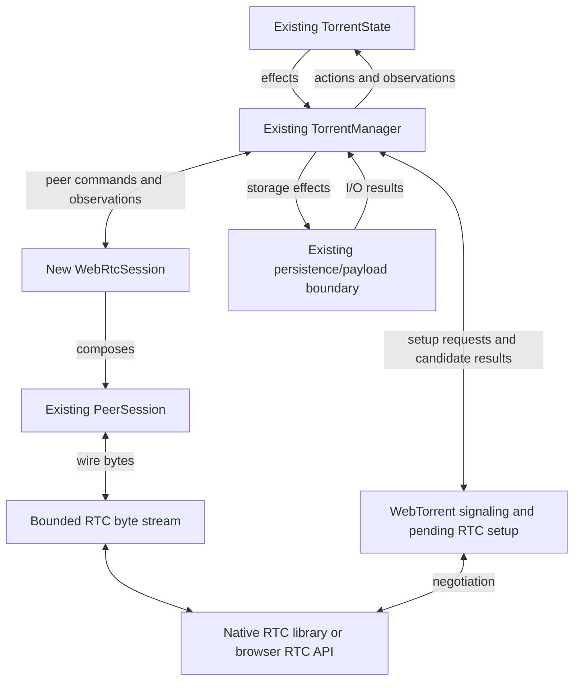
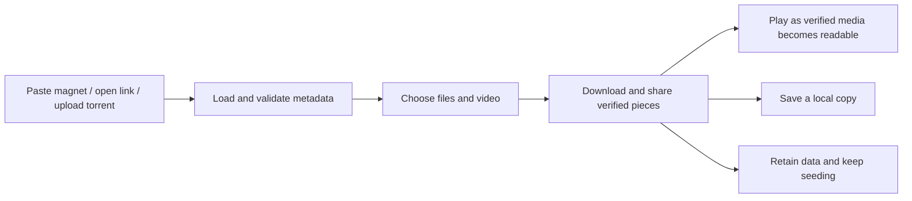

# Production WebTorrent and Portable Application Design

Status: active design, version 0.6. Started 2026-09-04.

This is the working design for WebTorrent integration, portable I/O, a full application-layer refactor, and a production browser website with video streaming, local saving, and seeding. The scope and authority boundaries are agreed direction. Proposed module layouts, APIs, and unresolved platform choices require implementation evidence; this document does not claim production readiness.

Reviewed baselines:

- Integration branch: `web-torrent-production`, based on `develop` at `eab382ba8d4b46ac7c09661b3c950ef2d5e6f59b`, including the Wasm merge.
- Reference POC: `feat/webtorrent-poc` at `23a2a11b3ab92ecec8b3cc3d28d9bd15dcd78573`.

- Sequential torrent mode is a user-reported recent addition. It is not present in the reviewed `eab382ba` tree or inspected local refs; its source revision and exact command contract must be reconciled before implementation. Existing sequential block-order tests do not establish that feature.

## Contents

1. [Objectives and scope](#1-objectives-and-scope)
2. [Agreed design constraints](#2-agreed-design-constraints)
3. [Authority and ownership](#3-authority-and-ownership)
4. [WebTorrent transport architecture](#4-webtorrent-transport-architecture)
5. [Peer lifecycle contract](#5-peer-lifecycle-contract)
6. [Portable I/O contract](#6-portable-io-contract)
7. [Full application refactor](#7-full-application-refactor)
8. [Full browser integration](#8-full-browser-integration)
9. [Website experience and file workflows](#9-website-experience-and-file-workflows)
10. [Video streaming and manager integration](#10-video-streaming-and-manager-integration)
11. [Source change map](#11-source-change-map)
12. [Delivery plan and acceptance evidence](#12-delivery-plan-and-acceptance-evidence)
13. [Production considerations](#13-production-considerations)
14. [Open decisions](#14-open-decisions)

## 1. Objectives and scope

### 1.1 Workstreams

| Workstream | Required outcome | Design section |
| --- | --- | --- |
| WebTorrent transport | Real WebRTC peers participate in the current manager/session download and upload flow | Sections 4–5 |
| Portable I/O | Every production host operation uses an explicit capability at its existing module boundary | Section 6 |
| Full application refactor | Shared application decisions and complete native/browser effect execution replace the mixed application orchestration | Section 7 |
| Full browser client | Real startup, transfers, persistence, file workflows, recovery, and supported integrations | Section 8 |
| Website and media experience | Magnet paste/deep links, torrent upload, playback during download, local saving, and seeding | Sections 9–10 |

Preserve the existing torrent manager, peer protocol, piece/block handling, resource and integrity services, and manager-to-payload boundary. The application refactor covers the complete app layer, including native-only responsibilities and existing browser adapters. It is an explicit workstream, not limited to the smallest changes needed to attach WebRTC.

### 1.2 Scope boundaries and sequencing

The first transfer milestone remains an actual WebRTC peer participating in the current native manager's normal download and upload flow. App refactoring and I/O extraction can progress alongside it. Completing every app workflow and host adapter is not a prerequisite for that transfer, but is required before declaring the overall app refactor and browser client complete. Section 12 defines separate acceptance gates.

The `state.rs` soft freeze remains in force. Full app scope does not authorize a general torrent-state, peer-policy, storage-scheduler, or protocol rewrite. Preserve native UI behavior and native features. The website experience and media/file workflows in sections 9–10 are now explicit scope; unrelated native visual redesign remains separate. Browser capability differences must be represented explicitly.

The POC is an uncertainty reference only. After the provenance and reliability audit, its imported implementation was removed in `465fa8dc`. Write the replacement independently from these ownership contracts and protocol specifications; do not copy or mechanically rewrite POC modules or tests. Preserve existing Superseedr code that predates the POC.

## 2. Agreed design constraints

1. **`TorrentState` remains authoritative for logical peer admission, retention, replacement, and removal.** It also retains piece scheduling, choking, integrity state, and work reassignment.
2. **`TorrentManager` executes decisions and routes observations.** It owns task handles, resource acquisition, execution identity, and effect completion. It must not introduce an independent WebRTC peer-selection or eviction policy.
3. **Treat `state.rs` as under a soft freeze.** Changes require a demonstrated integration or policy need, preserve its existing authority, and include focused regression evidence. Small compatibility changes, such as an optional endpoint or a narrowly necessary admission input/check, are allowed. This project does not initiate a general state-machine refactor.
4. **Add a WebTorrent networking module and a thin WebRTC session entry point.** Keep the existing BitTorrent peer protocol wherever it already supplies the required behavior.
5. **Centralize and abstract all platform-specific I/O at its existing module boundaries.** Shared torrent/application behavior calls explicit capabilities; native and browser backends perform physical operations. This covers networking, payload, application persistence, and host integrations. The Wasm merge moved `src/storage.rs` to `src/persistence/payload.rs`; preserve that manager-to-payload seam.
6. **Native and browser implementations share torrent behavior.** Platform-specific RTC, execution, and storage implementations attach to the same contracts.
7. **Use explicit workstream scope.** Complete the full app refactor and portable-I/O inventory defined here. Keep torrent-manager, state, and protocol changes tied to demonstrated integration needs; unrelated subsystem rewrites remain outside scope.
8. **I/O abstraction does not create a new authority.** Use focused interfaces within the existing modules. Keep domain policy, retry decisions, task ownership, and completion handling with their current decision/execution owners; do not introduce an all-purpose I/O manager or another torrent/storage scheduler.
9. **Fully refactor the application layer around shared actions/effects and focused execution modules.** Account for every responsibility in the existing app, including native-only features. Separate shared application decisions, presentation state, runtime resources, and platform I/O. Deliver complete workflows incrementally and remove superseded paths; moving a monolith into another file is not completion.

10. **The website and player use the shared app and current torrent manager.** Browser UI submits intent and consumes projections; the player reads verified retained payload. Sequential scheduling, peer admission, and integrity remain with their existing owners. Playback, torrent activity, saving, and seeding have distinct observable states.

## 3. Authority and ownership

| Component | Owns | Boundary |
| --- | --- | --- |
| Shared application state/reducers | User intent, application lifecycle, requested configuration, catalog/presentation state, and interpretation of operation results | Produces app effects and consumes facts; does not decide peer admission, piece validity, or torrent completion. |
| Native / browser app host | Service and manager construction, application task/channel lifetime, effect dispatch, and platform capability injection | Executes shared app effects and returns outcomes. Handles stay outside the reducer; application behavior is shared across hosts. |
| Website / media adapter | DOM interaction, media decoding/delivery, playback buffer and range demand | Sends app intents and uses bounded verified reads; owns no torrent scheduler, peer registry, or independent payload cache |
| `TorrentState` | Accepted peer membership, admission decisions, retention/removal, choke decisions, piece assignment, integrity state, and reassignment of abandoned work | Receives actions and produces effects. Other components do not directly mutate its peer collection. |
| `TorrentManager` | Action dispatch, effect execution, task/permit lifecycle, connection-generation bookkeeping, reliable result routing | A prepared connection or available permit does not grant admission. State makes the logical decision. |
| Existing peer-policy service | Restriction rules and policy snapshots | Supplies policy to the torrent state; it does not directly edit a torrent's peer membership. |
| WebTorrent signaling | WSS protocol, offers/answers, pending negotiations, protocol timers, tracker observations | Reports candidates and facts. Owns no competing accepted-peer set or torrent-level eviction policy. |
| `WebRtcSession` | One connection's established RTC resources, bounded byte-stream adaptation, transport cancellation and cleanup | Composes the shared peer protocol and reports termination. It does not choose pieces, peers, or torrent completion. |
| Existing `PeerSession` | Wire handshake, framing, BEP 9 exchange, request validation, protocol flow control, peer observations | Sends observations to the manager and consumes commands. It does not directly change torrent state. |
| Resource / network services | Available permits, bounded execution resources, authorized network access, invalidation | May prevent or terminate physical execution; their outcomes are reported without independently deciding torrent membership. |
| `persistence/payload` | File layout, random-access reads/writes, allocation, probing, physical cleanup | Returns outcomes to the manager. Torrent state determines the consequences for pieces and availability. |
| `persistence/app` and related persistence backends | Durable settings, catalog, history, and journals | Application-owned persistence remains separate from payload storage; completion reports actual persistence outcomes. |
| Platform execution and host adapters | Clocks, task execution, cancellation, system observations, user input/output, and external integration I/O | Supply operations and facts to the existing owners. Unsupported capabilities are explicit and do not fabricate success. |

A transport fault can close a physical connection immediately. The session reports that event, and the state performs logical removal and work reassignment. State-directed removal conversely produces effects that the manager executes to close the session. Both directions preserve one logical lifecycle.

Calling `state.update(PeerDisconnected)` is not sufficient to establish state authority if another component has already invented an eviction rule and selected its victims. The source of the decision matters as well as the location of the mutation.

## 4. WebTorrent transport architecture

### 4.1 Transport integration

The module may contain several files for signaling, RTC integration, stream adaptation, and session lifecycle. Those files implement one transport integration; their existence does not create new torrent authorities.

The signaling/negotiation side owns pending RTC objects until a successful handoff. The session then owns the established connection and its cleanup. Handoff, rejection, and cancellation must have explicit ownership so no two tasks assume they are responsible for keeping or closing the same connection.

The existing HTTP web-seed worker is a useful example of the manager/session command boundary. Its HTTP behavior is not a WebRTC contract: it synthesizes full availability and an unchoke, requires known metadata, and does not implement the full bidirectional peer protocol. WebRTC must learn remote availability and interest through the actual peer handshake/messages and retain upload and cancellation behavior.

### 4.2 Protocol reuse and library boundary

The renewed native implementation uses `webrtc` 0.17.1 with detached, pull-based DataChannels. SCTP is explicitly pinned to 0.17.1 because its 0.17.2 configuration API does not compile with that top-level release. Browser builds will use browser RTC APIs through an adapter; the native stack is target-gated.

`WebRtcSession` should compose `PeerSession` over a reliable, ordered, binary stream. Preserve existing BitTorrent protocol behavior rather than introducing a second scheduler or independent torrent client behind the session facade.

Keep these meanings of metadata separate:

- **RTC signaling data:** SDP, offers/answers, ICE candidates, and offer identities belong in the WebTorrent module.
- **Torrent metadata:** the BEP 9 info dictionary belongs in the existing peer metadata path, including hash verification and delivery through the manager/state boundary. BEP 9 does not supply the outer `.torrent` announce list. [BEP 9](https://www.bittorrent.org/beps/bep_0009.html)

## 5. Peer lifecycle contract

### 5.1 Discovery, preparation, and admission

1. Existing torrent decisions authorize discovery or connection work. The manager routes appropriate tracker work to the WSS implementation.
2. Signaling reports a candidate and performs bounded negotiation within the requested execution scope. An offer, allocated RTC object, or open DataChannel is not an accepted torrent peer.
3. When the candidate is ready for registration, the manager validates its execution identity and presents it to the current state-backed admission boundary.
4. Admission is evaluated against current state, including changes that occurred while negotiation was pending. Acceptance creates the state-owned peer entry and supplies the session command/cancellation relationship; rejection closes the candidate's resources.
5. The accepted session runs the shared peer protocol. Registered and successfully established remain distinct lifecycle facts; an RTC open event must not fabricate BitTorrent handshake success.

No asynchronous precheck is permanent permission to register. In particular, pause, deletion, admission-pressure changes, or execution invalidation during negotiation must be accounted for before the candidate starts participating.

### 5.2 Established sessions and removal

- Peer observations travel through the manager to existing state actions.
- State decides policy-driven retention/removal and releases or reassigns scheduled work.
- The manager executes returned disconnect/cancellation effects and completes resource cleanup.
- Physical EOF, protocol failure, or unavailable network access produces a terminal observation, followed by state-owned logical cleanup.
- Terminal delivery must be reliable and idempotent. An old callback must not affect a replacement connection, including replacement within the same network generation.
- A tracker connection closing does not itself authorize removal of healthy established RTC peers.
- Signaling reconnect may restore an authorized discovery service. It must not independently resurrect peers that state removed or undo pause/delete decisions.

### 5.3 Existing integration details to resolve

These are transport-boundary corrections. Keep them narrow; the full application refactor has its own scope in section 7:

- State's `Action::RegisterPeer` already accepts `Option<SocketAddr>`. Some manager commands still require `SocketAddr`; start by adapting that narrower boundary. An opaque RTC peer identity must not be represented by a fake socket address.
- `can_register_peer` currently checks duplicates and optional IP restrictions. State computes admission pressure, while the manager also consults pause/admission flags. Final asynchronous registration does not enforce every condition. Resolve the demonstrated late-admission path narrowly while keeping policy authoritative in state.
- An absent IP is not proof that an IP restriction was satisfied. Define which network/policy combinations the transport can support and report unsupported execution explicitly.
- Resume currently reconnects remembered addresses that parse as socket addresses and reannounces trackers. WebRTC discovery must follow that existing lifecycle, with a small contract extension only if required.
- Transport/session identity must distinguish the remote peer from one connection incarnation. Scope filtering must not discard the valid terminal acknowledgement needed to finish removal.
- The POC's eligibility reconciler can choose blanket WebRTC removals, and its tracker callback directly mutates tracker fields in state. Preserve useful cancellation mechanics while routing policy and tracker observations through the proper authority.

## 6. Portable I/O contract

Centralization means each kind of physical I/O has a clear owner and an explicit interface. Backend selection occurs at native/browser composition, and the selected capability is passed to the existing consumer. Shared code must not select a hidden global filesystem, instantiate an unrestricted network client, or access host services behind that boundary.

### 6.1 Coverage

| Boundary | Operations to cover | Existing integration home |
| --- | --- | --- |
| Payload storage | Prepare/open, inspect, read/write at offsets, resize as required, flush/checkpoint, close, and scoped removal | `persistence/payload` and the manager's storage-effect execution |
| Application persistence | Settings, torrent catalog/metadata, histories, RSS state, journals, atomic publication and recovery | `persistence/app` and related persistence backends |
| Networking | Peer streams/listeners, HTTP requests, WSS signaling, DNS, UDP, RTC, network invalidation | Existing networking/tracker/integration modules with native or browser adapters |
| File interaction | Browse, import metadata/seed data, choose destinations, and export verified content, including bounded saves during download | App/native/browser host capabilities; payload export reads use the existing payload backend |
| Media delivery | Read/wait for verified file ranges, report availability, cancel reads, and adapt bytes to browser media | App/manager read contract plus the existing payload backend; player adapters do not access the filesystem directly |
| External integrations | RSS fetch, watched folders, CLI/control endpoints, and other external services | Existing `integrations` owners; unsupported browser features are reported as unavailable |
| Input and output | Terminal events and rendering output, browser input, logging and diagnostic sinks | Existing TUI runtime and native/browser hosts |
| Host observations and execution | Clocks, sleeps/deadlines, task spawning/join/cancel, secure random input, process signals, memory/resource/interface observations | Small execution/host capabilities consumed by current owners |

Clocks, randomness, and task execution are platform dependencies even where they are not conventional I/O. They must be accounted for in the same portability audit. This does not require changing the shared async byte-stream traits, channels, parsing, serialization, or in-memory domain logic into platform services.

All transitive platform I/O counts, including I/O performed by an HTTP or RTC library. A library backend must honor the configured network authority or declare that configuration unsupported. Browser portability does not imply native-equivalent raw sockets, directory watching, or interface binding; capability checks expose real availability and prevent accidental simulated behavior in the client.

### 6.2 Payload abstraction

Supply an explicit payload capability through `TorrentParameters::with_payload` and retain it on `TorrentManager`. The builder produces `TorrentExecutionParameters`; this avoids changing the frozen state fixtures that construct `TorrentParameters` directly. Only test builds retain an implicit native conversion. Production composition injects its backend explicitly. Pass the same scoped handle to every payload task, including startup and later validation. Keep runtime handles and browser objects out of `TorrentState`; retain `MultiFileInfo` and shared span mapping there as data.

The shared payload functions translate torrent spans into file operations and retain existing padding, skipped-file boundary, sparse-read, and lazy-allocation semantics during extraction. Backend primitives perform the physical inspect/create/resize/read-at/write-at/flush/close/remove operations. Existing logical paths remain available to validation and presentation; browser physical names are resolved inside the torrent-scoped backend using stable torrent/file identity.

Payload writes, upload reads, allocation, v1/v2 validation, layout checks, integrity probes, and deletion now all pass through the same injected capability. Native filesystem execution stays inside `persistence/payload`. File browsing is an application host operation, even though `build_fs_tree` currently lives in the payload module; do not enlarge the torrent payload interface into an unrestricted filesystem API to accommodate it.

State continues to decide piece status, availability, priorities, and deletion intent. The manager retains execution retries, timeouts, permits, task draining, and result delivery. The backend may cache handles and serialize conflicting physical operations, but it does not reschedule torrent work or decide that a torrent is complete.

### 6.3 Observable guarantees

- **Readable completion:** a successful write means the complete requested span is available to subsequent reads. A failed multi-file write may have made partial progress and must not produce a success event.
- **Explicit durability:** checkpoint/commit completion has a documented backend guarantee separate from an ordinary completed write. Catalog/resume records must not claim persisted payload before the corresponding payload barrier succeeds. Recovery revalidates uncertain content; correctly sized files alone do not prove integrity.
- **Explicit lifecycle:** task cancellation and the physical operation's completion/abort are distinguished. Drain pending operations and close handles before scoped deletion or ownership release; dropping a future does not prove an underlying browser operation stopped.
- **Scoped identity:** cloned handles retain their selected storage/network context. Stale work cannot write into a replacement torrent namespace or act under a new network generation.
- **Bounded execution:** resource limits apply to open handles, pending requests, buffers, and conflicting writes. Backends report pressure/errors through the existing execution path.
- **Useful failures:** unsupported operations, missing data, access denial, quota exhaustion, contention, and transient failures remain distinguishable. State and its executor receive facts rather than false success or indefinite retries.
- **Appropriate target bounds:** native tasks can retain their thread-safety requirements while browser handles/futures stay local. Do not force JavaScript resources across threads with unsafe `Send`/`Sync` implementations.

### 6.4 Extraction and verification

Start by introducing the payload interface with a native implementation and routing every payload path through it. Verify existing data-layout behavior and read-after-write semantics before adding the OPFS implementation. Extend the same pattern to network, app-persistence, and host boundaries as the integration reaches them. The first native WebRTC milestone and the completion of browser portability are separate acceptance points.

Keep an inventory of remaining direct host calls and isolate them in designated native/browser implementations. Tests and platform adapters may use real host APIs; shared production control/protocol paths may not bypass the selected interfaces. A source/dependency audit supplements actual execution tests and must distinguish portable traits/channel usage from physical host I/O.

Require native regression evidence and browser backend contracts for the extracted operations, followed by tests using the actual Wasm manager/session path. Compiling a demo that excludes the manager, or passing an isolated storage harness, is not full portability evidence. Browser qualification must exercise probe, recheck, restart, failure, and deletion as well as successful transfers.

## 7. Full application refactor

### 7.1 Scope and current starting point

Refactor the complete application layer: shared app models, commands and reducers, native `App`, browser `BrowserSession`, and the application behavior embedded in UI/runtime adapters. Every existing responsibility must be assigned to a shared application module, an existing domain/service owner, a presentation module, or a platform executor. Native-only features are part of this inventory and remain implemented behind their appropriate host boundary.

The Wasm merge already shares `AppState`, UI reducers, rendering, `RuntimeHost`, and `AppAction`/`AppEffect`. Most orchestration remains in `src/app/native.rs`; `src/app/mod.rs` also mixes substantial application and presentation definitions. Browser execution in `src/web_integration/session.rs` and `src/tui/runtime/browser.rs` contains a separate, partly simulated subset. The current app reducer handles telemetry/sorting and forwards other manager events through `HandleManagerEvent`, leaving their application meaning to different hosts.

Extend those existing seams. The intended result is one implementation of application behavior, used by native and browser hosts, with focused modules for execution and explicit platform capabilities. Exact filenames and enum shapes below are proposed; the responsibilities and complete coverage are required.

Implementation ownership and the concrete native/browser contracts are recorded in [Application refactor](app-refactor.md).

### 7.2 Application authority and state ownership

| Scope | Decisions and data | Execution boundary |
| --- | --- | --- |
| UI reducers and `RuntimeEffect` | Selection, dialogs, navigation, presentation, and translating input into user intent | Presentation-only work stays in the UI path; application commands enter the shared app action flow |
| Application actions/effects | Startup/restore, add/remove workflows, requested configuration, pending operations, catalog changes, and interpretation of manager/service outcomes | The app host constructs managers, sends commands, invokes persistence/host capabilities, and returns results |
| Torrent actions/effects | Torrent execution policy, accepted peers, pieces, integrity, and logical torrent lifecycle | Existing `TorrentManager` and session/storage boundaries execute `TorrentState` decisions |

Group application lifecycle/catalog data, presentation state, and runtime resources according to those responsibilities. `AppState` can remain the composed shared state exposed to the renderer while its definitions and transitions move to focused modules. Establish one owner for each fact; do not maintain independent native/browser catalogs or settings rules. Requested, effective, and persisted values represent different facts and must be named accordingly.

Reducers operate on data and explicit inputs, including capability facts and time observations where needed. They perform no physical I/O, task spawning, or direct mutation of manager state. Manager/service handles, channels, file/RTC objects, and cancellation handles remain with executors. Pure helpers and existing focused schedulers remain reusable; every helper or UI mutation does not need a new app action.

The app requests pause, removal, recheck, or service reconfiguration and tracks the outcome. Torrent state determines torrent behavior. Metrics are observations for presentation; app completion effects do not establish possession of pieces or replace integrity decisions. Preserve the current resource, network, peer-policy, and integrity service ownership when relocating app coordination.

### 7.3 Proposed module organization

| Location or module group | Intended responsibility |
| --- | --- |
| `src/app/mod.rs` | Small module facade and compatible re-exports; no replacement orchestration monolith |
| Shared app model modules | Application lifecycle, catalog/configuration, operation identity/status, and the composed `AppState`; presentation definitions stay grouped separately |
| Shared app action/effect modules | Typed application intents, observations, requested effects, and asynchronous results; preserve existing manager protocol types where sufficient |
| `src/app/reducer.rs` and focused reducer modules | Dispatch and application transitions grouped by lifecycle, torrent operations, settings, ingest, and service outcomes |
| Focused app execution modules | Common effect orchestration and access to application-owned manager/service registrations through explicit capabilities; one runtime owner for each registration/task |
| `src/app/native.rs` and focused native host modules | Native composition, event loop, OS input, locks/watchers/listeners, and native adapter wiring; reuse shared application decisions |
| `src/web_integration/session.rs` and related browser host modules | Browser composition, input/result adaptation, local execution and shared state exposure; use the same application operations |
| `src/tui/` state, reducers, effects, and rendering | UI-specific behavior and derived presentation; application intents cross the app boundary |
| Existing `persistence`, `integrations`, `networking`, `resource`, and integrity modules | Retain domain/service behavior and platform I/O implementations at their current boundaries |
| Tests beside their owning modules and integration suites | Move existing app tests with the behavior they qualify; retain end-to-end host tests for lifecycle and compatibility |

Names can evolve during extraction. A new file must have a clear responsibility and dependency direction; do not introduce another app engine, all-purpose I/O manager, generic effect framework, or a second registry for the same manager instances. Native/browser composition selects implementations once and supplies them to the existing consumers.

### 7.4 Complete responsibility inventory

This inventory defines the full app-refactor scope. During implementation, track each existing handler/field group and its new owner; record any additional responsibilities discovered before declaring completion.

| Responsibility | Shared application behavior | Execution or existing owner to preserve |
| --- | --- | --- |
| Bootstrap and restore | Loading/ready/recovery status, restored settings/catalog/history, deferred torrent starts, and startup completion handling | App persistence, host capabilities, service/manager construction, and existing startup pacing |
| User and external command ingestion | Normalize UI, paste, CLI/control, RSS, and watched-input requests; preserve origin, validation, duplicate handling, and results | Existing integration parsing/ingest policies; host file acquisition, staging, archive, forwarding, and delivery |
| Add, metadata, preview, and file selection | Pending adds, priorities, preview identity, dialog hydration from verified metadata, and catalog transitions | Existing metadata/manager path, file-browser capability, cancellable preview work, and metadata persistence |
| Torrent controls and runtime membership | Start/pause/resume/configure/recheck/remove requests, pending status, observed results, and desired app-level manager inventory | App executor manager handles/channels; torrent logical decisions remain in `TorrentState` |
| Settings and configuration reload | Change interpretation, applicable settings, requested/effective/saved state, UI updates, and reconciliation outcomes | Actual network/resource/rate/RSS/watcher reconfiguration and persistence; retain native failure/rollback behavior |
| Shared mode and role transitions | Existing leader/follower permissions, command routing, read-only views, existing role transitions and their consequences, and catalog-write eligibility | Existing cluster/control owners, native locks, shared persistence, status snapshots, and recovery backups |
| Network and service coordination | Interpret network/service availability, activation status, and app-level consequences | Existing network scopes, DHT, listeners, inbound-handshake routing, and peer-policy services; routing is not peer admission |
| Resource tuning and data health | App projections, history, requested follow-up work, and explicit unavailable observations | Existing tuning/resource controllers, token buckets, integrity scheduler and manager probes; do not recreate these algorithms in app reducers |
| App persistence and recovery | Settings/catalog checkpoints, metadata snapshots, RSS/history/journal state, dirty/committed revisions, and recovery decisions | Existing persistence/serialization modules, durable backends, ordered commits, and writer ownership |
| Presentation and telemetry | Sorting, filtering, selection, file trees, peer views, warnings, histories and completion notifications derived from facts | Existing UI reducers/renderers/telemetry; native/browser adapters supply transport-aware identities and real observations |
| Website playback, export, and seeding | Selected media/file, playback intent, export jobs, retained-data and seeding preferences, and actual results | Browser player/file adapters, bounded verified manager/payload reads, existing upload path, and app persistence |
| Periodic and external output | App deadlines and required snapshots/journal output under current policies | Host clocks/timers, diagnostic/status sinks, integration services, and existing history/journal policies |
| Shutdown, cancellation, and restart | Stop accepting work, track pending operations, coordinate cleanup/checkpoints, and expose incomplete recovery work | App task/manager/service lifetimes, persistence draining, native terminal cleanup, and browser lifecycle events |

### 7.5 Action, effect, and result contract

All supported ingress paths invoke the same application operations after their source-specific normalization. Preserve origins and identifiers needed for control responses and journals. Keep `AppCommand`, UI effects, browser commands, and external request formats as adapters where needed; converge their meaning on the shared app action flow instead of retaining parallel policy implementations.

An app action may update pending state and emit effects. Executors carry out those effects and return explicit outcomes. A queued effect or successful channel send is not operation completion. Closed/full channels must not silently discard lifecycle commands or terminal results. Replaceable telemetry can be coalesced; reliable control completion requires a separate delivery contract.

Use operation identity and relevant torrent/host generation where work can outlive its target. Reject stale results without losing acknowledgements needed to clean up the original operation. Serialize conflicting operations at their owner, bound queues, and define duplicate-result behavior. Do not require a global sequence for unrelated work or block input while awaiting I/O.

Keep the reducer's interpretation of a result shared even when physical execution differs. For example, a file preview receives the same success/failure model whether its bytes came from a native path or a browser-selected file. Native path objects and browser handles must resolve through the selected capability; a browser display path is not an OS filesystem authorization.

### 7.6 Persistence, settings, and deletion semantics

The existing synchronous `AppPersistence` interface cannot represent a completed asynchronous browser commit merely by updating memory. Model startup hydration and subsequent commits explicitly. Track revisions so an old save completion cannot clear newer dirty state, and expose write failures through application outcomes. Preserve existing config/catalog formats and restoration behavior; intentional format changes need a migration and recovery plan.

Settings application must distinguish requested values, effective service configuration, and durable saved values. Preserve existing native rebind/failure handling while making outcomes explicit. Define partial-application and rollback policy per affected service; do not imply that updating an in-memory settings object proves every service applied the change. Native-only settings remain valid natively, and the browser reports unsupported changes through capabilities.

Removal distinguishes stopping a manager, deleting payload, removing catalog state, and committing that removal. Current native handling logs deletion failure but still removes runtime entries; browser handling discards the failure. The shared policy must release terminated resources while retaining a visible, recoverable cleanup failure. Qualify this deliberate correction separately from mechanical extraction. A late save or callback must not recreate a removed entry or affect a newly added incarnation of the same torrent.

Payload durability and revalidation retain the guarantees in section 6. The app coordinates requested checkpoints and catalog publication through existing owners; it does not infer verified content from filenames, lengths, or cached display metrics.

### 7.7 Runtime ownership and host lifecycle

Keep one application execution owner for each manager registration, command/event channel, service subscription, preview task, periodic task, and persistence operation. Move those responsibilities out of the large native host into focused execution modules without duplicating them. Native and browser hosts may use different task primitives and event-loop mechanics while executing the same application operation/result contract.

Define start, ready, stop-requested, terminated, and cleanup outcomes where needed. Stop accepting new conflicting work during shutdown, cancel or drain owned operations, consume required terminal results, and report checkpoint completion. Dropping a future is not proof that a browser write or other external operation stopped. Shutdown/restart must account for already-started physical work and stale callbacks.

Progress and operation deadlines must be independent of rendering cadence. Native signals and browser suspend/resume observations enter their host boundary; abrupt browser loss is handled by durable checkpoints and recovery, without assuming an unload callback can finish asynchronous work. UI teardown remains with the host, and app teardown must not require a terminal renderer.

### 7.8 Capabilities, compatibility, and completion boundary

Preserve native feature behavior while extracting it, including shared mode, file/control ingestion, RSS, configuration reload, history/journals, status output, and terminal lifecycle. Retain compatible entry points and re-exports while callers migrate. Shared mode retains its existing authority and implementations; the browser must not simulate native locks or claim leader capabilities it does not implement.

Browser hosts expose actual storage, file, network, integration, and observation capabilities. Unavailable native features are explicit; values such as OS resource readings are unavailable rather than fabricated. Peer presentation accepts transport identity without requiring `SocketAddr`. Demo fixtures and command simulation remain explicitly selected demo dependencies and are absent from real-client composition.

The full refactor is complete when every responsibility in section 7.4 has an owner, native and browser application workflows use the shared transitions, physical I/O stays behind selected capabilities, and superseded application handlers are removed. `app/mod.rs`, native `App`, and `BrowserSession` must not retain fallback copies of migrated behavior. A smaller file count or successful Wasm demo build alone is not acceptance. Section 12 supplies the migration sequence and evidence gates.

## 8. Full browser integration

### 8.1 Current capability and integration target

The merged Wasm application already shares presentation, reducers, state models, and manager command/metric/event contracts. Its torrent activity is simulated; the actual manager and peer runtime remain excluded from Wasm. Reuse that work and attach the same WebRTC session contract to the browser RTC implementation.

Browser execution work should adapt the paths used by this integration: task spawning, timers, cancellation, local futures, resource limits, and payload access. Complete the shared application refactor in section 7 alongside these adapters. The existing browser app also needs real startup/restore, settings propagation, file workflows, lifecycle results, and transport-aware presentation; connecting a real manager alone does not complete it.

### 8.2 Execution and storage placement

Proposed browser direction, to validate during that phase:

- Keep browser-required RTC negotiation APIs in the window and adapt their data path to the Rust session. Worker placement and direct DataChannel transfer remain implementation choices to qualify. The WebRTC specification exposes `RTCPeerConnection` to Window and supports transferring DataChannels under defined conditions. [WebRTC specification](https://www.w3.org/TR/webrtc/)
- Use an application worker where needed for responsive execution and OPFS access. If rendering crosses the worker boundary, preserve incremental ANSI ordering/backpressure. Transfer progress must not depend on animation frames.
- Implement OPFS behind `persistence/payload`, preserving layout, boundary pieces, padding, selected files, and integrity semantics. Keep app/catalog persistence behind `persistence/app`; its current synchronous memory-backed browser implementation needs a deliberate durable-commit design.
- Keep demo and real-client composition explicit. Runtime capabilities and telemetry must report actual supported behavior.

### 8.3 User workflows and interoperability

The full browser acceptance path adds WebRTC-only BEP 9 magnets, durable reload/resume, recheck, file selection, export, and seeding. Browser support/version limits, exact worker topology, catalog backend, and export mechanisms remain open decisions.

Browser WebTorrent requires compatible WebRTC peers; WSS signaling alone does not bridge ordinary TCP/uTP payload. Native Superseedr can participate in both transport populations using the same verified pieces. [WebTorrent FAQ](https://webtorrent.io/faq)

The application workflows must also cover capability errors, failed manager commands, settings application, persistence failures, cleanup failures, and restored user selections. Any integration offered in the real browser UI must have a real executor; otherwise it is explicitly unavailable. The complete browser gate is in section 12.4.

The browser host needs a production app facade for DOM controls and structured view updates. The current facade constructs `BrowserDemo`, exposes terminal/simulation functions, and has no media or file-export implementation. Website commands must call shared app operations directly; they must not emulate terminal key presses. Sections 9–10 define the additional website and playback contracts.

### 8.4 Ownership across tabs

The browser host and persistence backends must enforce one mutation owner for shared catalog/payload namespaces across browser contexts, not only within one app instance. Define second-tab behavior explicitly; the initial implementation may allow only one active client. Recovery after owner loss must exclude the old context from resuming writes after replacement. This is a host/storage ownership contract, not a new torrent-state authority.

### 8.5 Compatible application updates

Version the page/Wasm/worker bridge and persisted schemas. Define a safe update/activation boundary, keep required assets available to an active client, and reject unsupported schema mutation. Coordinate updates with active transfers and persistence draining; an old page must not unknowingly drive a new incompatible worker or write a migrated catalog. Web composition/deployment, the browser host, and app persistence own this contract.

### 8.6 Recovery across catalog and payload

Track interrupted create/import/delete operations with durable operation/incarnation records or an equivalent recovery mechanism. Startup must reconcile missing payload targets, orphaned retained data, and unfinished deletion across the catalog and payload stores. Recover or expose incomplete operations without advertising unverified bytes or discarding recoverable user data. Shared app lifecycle and existing persistence/manager executors own this coordination; do not introduce a cross-store transaction service.

### 8.7 Worker and bridge failure

Define terminal failure handling when an app worker or bridge dies while the page, RTC connections, or media requests remain alive. The browser host must stop accepting dependent commands, resolve or expose outstanding operations, release orphaned resources, and restart through durable restoration. Use bounded diagnostics with build and operation identity through existing logging facilities, excluding raw source links and credentials. Failure handling must preserve task ownership and generation boundaries across the bridge.

## 9. Website experience and file workflows

### 9.1 Product shape and page organization

Build a responsive website centered on opening a torrent, watching supported video during download, saving files, and keeping verified data available to peers. Keep the shared Rust application and torrent runtime underneath. The existing terminal renderer remains a separate presentation option; the main website uses DOM controls and a real media element.

| Page area | Content and actions |
| --- | --- |
| Open torrent | Magnet text field with ordinary paste, primary Start action, Upload torrent file, and a drag/drop target; a Seed local files entry opens the verification workflow |
| Active torrent header | Resolved name, download progress, actual peer/upload activity, Pause torrent / Resume, Save, and removal controls |
| Player and media selection | Large player, file selector for multi-file torrents, playback/buffering status, buffered timeline, and codec/error feedback |
| Files | Filename, size, selection/priority, verified completion, Play when supported, and Save for each retained file |
| Transfers and library | Active downloads, completed retained files, seeding state, saved-copy/export jobs, storage use, and restart/resume status |
| Details and preferences | Peer/transfer details, upload/download limits, storage settings, and actual platform capabilities |

Desktop can place the player beside the file/transfer panel; narrow layouts stack them and retain accessible controls. Use normal scrolling, keyboard navigation, visible focus, labels, and status announcements. Touch support and media controls need a website acceptance contract; the terminal demo's existing desktop-only assumptions are not sufficient.

### 9.2 Magnet paste, URL parameters, and torrent upload

All entry paths normalize into the same shared app add operation with an operation ID and source origin.

| Input | Proposed behavior |
| --- | --- |
| Pasted magnet | User pastes into the field and selects Start; validate with the shared magnet parser and show parsing/metadata/peer errors in place |
| URL parameter | Accept `?magnet=<URL-encoded magnet>`; optionally accept a file index hint that is validated after metadata arrives |
| Share link | Prefer a fragment form such as `#magnet=<encoded value>` for generated links, while supporting query parameters from integrations; neither form grants local file access |
| Torrent upload/drop | Accept a browser-selected `.torrent` file, apply bounded metadata parsing, then enter the same preview/file-selection/add path; browser file acquisition supplies bytes or a capability handle |
| Duplicate torrent | Focus the existing transfer and reconcile a requested media selection; do not start another manager or silently replace its storage/settings |

Proposed URL default: populate the entry and let Start initiate the transfer. Automatic start from a deep link is an open product choice; it must not be confused with automatic playback. Parse URL encoding once, preserve nested magnet tracker parameters, bound input, and report conflicting/invalid parameters. A file hint is an index into verified metadata, never an arbitrary local path. Treat titles and paths as text, and keep raw magnet/query data out of routine analytics and external navigation.

Uploading a `.torrent` imports metadata locally; the page does not need to send it or the payload to an application server. It also does not supply the file bytes needed for seeding. Magnet metadata comes from the existing verified peer path. Preserve tracker provenance and private-torrent handling instead of injecting public trackers for convenience.

### 9.3 Start, choose, and watch

The page shows metadata loading, connecting, downloading, ready-to-play, buffering, and failed outcomes from the actual app/media paths. If one supported video is present, select it for playback; if several are present, offer a clear file list. Preserve the user's download selections: selecting a video does not silently skip or discard other selected files.

Play requests the manager's sequential mode for the selected transfer/file where supported. Readiness is based on required media metadata and playable buffered data, not an arbitrary torrent-completion percentage. Show downloaded bytes and playable media time separately. The Play action handles browser autoplay rejection and remains available after buffering; audible autoplay cannot be assumed. [Browser autoplay guidance](https://developer.mozilla.org/en-US/docs/Web/Media/Guides/Autoplay)

### 9.4 Independent controls and state

| User action or state | Required meaning |
| --- | --- |
| Pause video | Pause the media element; downloading and uploading continue under torrent policy |
| Pause torrent | Request existing manager pause behavior; downloading/uploading may stop, while already buffered video can continue |
| Save locally | Start or queue a separate export job from retained verified bytes; playback and seeding continue |
| Video ended | Playback ended; this does not remove data, pause the torrent, or prove the torrent is complete |
| Keep seeding | Retain verified payload and leave the manager active after selected downloads finish; show waiting for peers separately from actual upload traffic |
| Stop seeding | For a completed download, request torrent pause; any separate upload-only control during download requires an explicit supported manager contract |
| Remove torrent / delete data | State clearly whether app registration, retained browser data, or both are removed; cancel/drain active readers through the shared removal workflow |

Proposed default is to keep seeding while the app remains active, with the preference visible before starting. State that downloading also shares verified pieces. Persist the user's preference and show actual upload speed/bytes and peer availability. Navigating between pages or finishing a video must not tear down the transfer. Browser suspension/closure can stop execution; do not promise background seeding after the app closes.

### 9.5 Save locally and retained browser storage

Treat browser-managed payload storage and a user-visible local copy as distinct locations. Initial design: OPFS remains the canonical retained payload for downloading, playback, upload, and resume; Save copies verified bytes into a user-selected sink. Saving does not remove the retained source or silently change seeding behavior. OPFS is quota-managed origin storage and can be deleted with site data; a retained browser copy is not equivalent to an exported file. [OPFS storage behavior](https://developer.mozilla.org/en-US/docs/Web/API/File_System_API/Origin_private_file_system)

Where supported, a Save click acquires a writable destination under that user gesture, then runs a bounded export through the shared app. If the file is still downloading, the export waits for verified ranges and reports progress; mark success only after the final bytes and destination close/commit succeed. Cancelling or failing an export affects that job and reports any partial-output implications. The save picker requires user activation and cannot be assumed across browsers. [Save-file picker](https://developer.mozilla.org/en-US/docs/Web/API/Window/showSaveFilePicker)

Provide a qualified download fallback for browsers without that picker, using a completed file-backed source or a bounded streaming response where supported. Never assemble an entire large video in a JavaScript byte array simply to save it. Report Saved only for an observed writable-sink completion. A browser-managed download may expose only handoff, so report Download started and let the browser own final destination/cancellation feedback; do not claim disk completion the app cannot observe. Show actual fallback limitations before promising Save, and include at least one supported local-saving path in every released browser's capability matrix. Multi-file saves can use individually selected files first; directory selection or streamed archives are implementation choices to qualify.

Direct downloading into a user-selected destination is a later backend option only if it meets the same random-read/write, concurrent playback/upload, validation, durability, and restart contracts. Do not introduce a second payload store whose copy silently becomes authoritative. An exported copy alone does not keep a torrent seedable after retained data is removed; it must be selected again and verified or used through a qualified retained-handle backend.

### 9.6 Seed existing local data and resume seeding

Support seeding both newly downloaded content and existing user-selected files. For existing content, obtain the matching torrent metadata (uploaded `.torrent` or verified magnet metadata), ask the user to select the matching payload files/folder, map them by the torrent manifest, and validate hashes through the existing manager/storage path before advertising availability. Filenames and lengths alone are insufficient. Mismatched data produces a useful result; it must not be advertised or silently overwritten as an automatic repair.

The first local-seed implementation may import the selected bytes into torrent-scoped browser storage, subject to quota. Verify the retained destination bytes after copying and before advertising them; checking the external source before an import does not protect against source changes during copying. Retaining readable file handles without a copy is a capability-dependent alternative: uploads must read the validated stable snapshot, and changes/access loss require invalidation and revalidation through the existing manager/state path. If the backend cannot guarantee snapshot stability, import into owned storage first. Handle permission renewal on resume. Both paths feed the existing upload path and resource controls. Creating a brand-new torrent from arbitrary files is a separate product decision from seeding an existing torrent.

On reload, restore seeding intent and retained identity, verify availability as required, then reconnect through the existing discovery/session path. Report permission or missing-data problems instead of presenting cached seeding status as live activity. Sharing only some verified pieces is useful uploading; selected-file completion must not advertise a complete seed for an incomplete torrent.

### 9.7 Website-to-app interface

Expose a production Wasm facade for normalized app intents, immutable/coalesced view updates, reliable operation results, and bounded media/export reads. Proposed operations include add source, select media, request playback, pause/resume torrent, start/cancel export, import seed data, and remove. Exact types must align with the full app refactor; the website must not invent a second torrent model.

Keep large payload buffers out of routine app/DOM snapshots. Bridge bytes with bounded chunks, cancellation and backpressure, and use transferables where supported. Playback position, browser-buffered time, selected file, verified download progress, export progress, and upload activity are separate observations. UI rendering must not drive manager execution or storage completion.

## 10. Video streaming and manager integration

### 10.1 Sequential-mode integration dependency

Use the user's new torrent-manager sequential mode once its source revision is available in this integration. The reviewed baseline still chooses work by rarity or file priority followed by rarity; sequential block requests within a piece are not sequential torrent playback. Record the actual mode/configuration command, persistence semantics, file scope, and interaction with priorities before connecting the website.

The app requests playback intent and an appropriate download mode; `TorrentState` remains the scheduling authority and `TorrentManager` executes its decisions. No browser worker, player, or service worker selects peers or independently downloads missing pieces. Restore user scheduling preferences when a temporary playback override ends, without overwriting a newer user choice.

Sequential mode supports forward downloading but does not automatically provide arbitrary seeks, tail-metadata fetches, or a contiguous-readable-range API. Audit those separately. Reuse existing demand/priority contracts when sufficient; any missing manager/state input requires a narrowly demonstrated extension under the soft freeze. Do not claim seek support based only on the sequential-mode flag.

### 10.2 Verified file-range read contract

Introduce a bounded read/wait contract at the existing app-to-manager/payload seam for a torrent incarnation, file identity, offset, length, and cancellation identity. Manager/state observations determine which bytes are verified and retained; the executor reads them through the same scoped payload capability used by uploads and validation. This is a local-consumer request path: do not register a fake peer or count playback/export reads as swarm upload traffic.

- Successful reads expose only bytes whose integrity has been established and whose storage write is readable, including valid restored data. Availability updates reflect those facts, not network receive counts or optimistic UI progress.
- Map file-relative ranges through existing torrent span/piece mapping, including boundary pieces, padding, selected files, and supported v1/v2 layouts. Do not expose adjacent-file bytes.
- Missing spans wait with cancellation/deadline handling or return an explicit unavailable/failure result. They are never reported as EOF, fabricated zero bytes, or a successful short read within the known file length.
- Keep reads, queued requests, metadata probes, and buffers bounded. Cancel stale requests on seek, media change, removal, or host generation change; clean up outstanding operations before storage deletion.
- Route playback, export, and peer-upload reads through existing storage/resource controls. Playback demand may influence authorized scheduling, but must use bounded disk/memory budgets and preserve fairness with peer uploads. Local reads do not consume network upload token buckets; actual peer uploads retain their configured network limits.

The current payload helper zero-fills some missing/skipped-file and beyond-EOF reads, and current metrics do not expose verified contiguous ranges. A player cannot safely use those reads or aggregate completion directly. Add the strict consumer contract and authoritative availability reporting while preserving existing storage behavior for other callers until deliberately changed.

### 10.3 Container and codec handling

Separate three prerequisites: verified bytes, enough container/index metadata to locate samples, and decoder support. An MP4 index can require bytes near the end; sequential progress from the start may therefore stall initialization even when early media bytes exist. The playback adapter must request required metadata through the same manager demand contract, or report that this file cannot start progressively under the available mode. Never rewrite original torrent bytes to move metadata: that changes their hashes. [MP4 indexing and fast-start behavior](https://ffmpeg.org/ffmpeg-formats.html)

Detect actual container/codecs and test the selected playback path; an extension or positive capability probe is not proof of successful decoding. Unsupported media remains downloadable and seedable with clear playback feedback. Publish a tested container/codec/profile matrix rather than claiming every video file plays in every browser. [Media capability probing](https://developer.mozilla.org/en-US/docs/Web/API/HTMLMediaElement/canPlayType)

### 10.4 Media delivery adapter

Proposed first implementation to qualify: a browser `<video>` element reading a scoped same-origin virtual media URL, with a service-worker range adapter forwarding bounded reads to the active app/payload owner. This can preserve original file bytes and let the browser perform native media demuxing. It is a proposed implementation choice, not an established cross-browser capability of the current app.

For that path, implement correct HEAD/full/range behavior, content type and lengths, byte offsets, valid `206` responses and out-of-range `416` responses. Missing downloaded bytes are a buffering/availability condition, not an out-of-bounds range. Support the bounded, suffix, and open-ended requests exercised by target media engines; define multipart handling and test it. [HTTP range semantics](https://developer.mozilla.org/en-US/docs/Web/HTTP/Guides/Range_requests)

Scope virtual URLs to the active torrent/file incarnation and authorized local client, never arbitrary filesystem paths. The adapter must only intercept its media routes and must not publish payload to a remote server. Keep OPFS handles with their existing owner rather than opening competing writer/read handles in each worker. Use bounded message/stream flow, abort propagation, and explicit app-unavailable responses. Do not store unbounded movie copies in the service-worker cache.

A service worker is an event-driven adapter, not the torrent engine or a guarantee of continuous background execution. Qualify initial control/activation, base-path deployment, navigation, app suspension, and worker termination/update behavior before release. [Service-worker lifetime](https://www.w3.org/TR/service-workers/#service-worker-lifetime)

Media Source Extensions is an alternative for formats that require an explicit segmented pipeline. It requires valid initialization/media segments; arbitrary torrent chunks of an ordinary MP4 cannot simply be appended. If remuxing is needed, use an evaluated library with bounded memory and keep transformed playback bytes separate from original upload/export data. Decoder transcoding is a separate cost/support decision, not assumed scope. Select and qualify the first delivery path before implementing multiple pipelines. [MSE MP4 byte-stream requirements](https://www.w3.org/TR/mse-byte-stream-format-isobmff/)

### 10.5 Buffering, seeking, and playback state

Track playable buffered time independently from verified downloaded ranges. Start after the chosen media path has initialization data and a measured startup buffer; choose bounded startup/rebuffer targets from qualification. Release consumed player buffers without deleting retained torrent payload needed for seeding.

Seeking uses media/index knowledge to express a desired range through the app/manager boundary. Cancel obsolete demand, request the new playback window and required metadata, and return to buffering until verified data is available. Seek into already retained data should not redownload it. Where the actual manager contract only supports sequential forward progress, expose that limitation rather than showing an immediately seekable whole-file timeline.

Playback pause releases or reduces transient prefetch demand while preserving torrent execution according to its settings. Ending playback or changing files releases its read lease and temporary scheduling intent. Slow/no peers, unsupported decoding, missing metadata, quota/storage failure, user pause, and deleted source each need distinct outcomes; an endless loading spinner is not sufficient.

## 11. Source change map

| Location | Integration work |
| --- | --- |
| `src/networking/webtorrent/` | New signaling, native/browser RTC integration, bounded stream, and thin session implementation. Port selected POC behavior. |
| `src/networking/mod.rs`, `model.rs`, and transport boundary | Expose the integration and identify WebRTC peers without inventing an IP address. |
| `src/torrent_manager/command.rs` | Narrow registration/result plumbing and execution identity where the current command contract is insufficient. |
| `src/torrent_manager/manager.rs` | Route tracker/setup work, submit candidate/session observations, execute effects, and own task/permit cleanup. |
| `src/networking/session.rs` and `protocol.rs` | Reuse protocol behavior; make only required stream, identity, metadata, or execution adaptations. |
| `src/tracker/` | Recognize and route WSS trackers through the existing tracker boundary and preserve tracker facts and announce semantics. |
| `src/torrent_manager/state.rs` | Stable contract. Only narrowly demonstrated compatibility or correctness changes under the soft-freeze rule. |
| Shared telemetry and presentation types | Report actual WebRTC transport/bytes/events using existing aggregation. |
| `web/src/`, `web/index.html`, and production Wasm bindings | Responsive website, magnet/deep-link/file input, typed app commands/views, player, transfer/library, save and seeding controls; keep the demo entry explicit |
| Media/read integration modules and browser adapters (exact paths proposed) | Verified file-range contract, sequential-mode request plumbing, cancellation, media delivery and export, without duplicate payload or scheduling ownership |
| Web build/deployment and tests | Qualify production media/worker assets, relative base paths, capability-dependent saving, bundle budgets, and actual website workflows |
| `Cargo.toml` and lockfiles | Explicit dependency/feature wiring with native/browser target separation. |
| `src/persistence/payload.rs` and manager storage helpers | Explicit payload backend; route writes, reads, allocation, validation, probes, and deletion through the same instance. Preserve native behavior first, then add OPFS. |
| `src/persistence/app.rs` and related native persistence modules | Centralize app/catalog/history I/O behind their existing capabilities, including explicit browser restore/commit semantics. |
| `src/app/mod.rs`, `src/app/reducer.rs`, and focused shared app modules | Full responsibility-based decomposition: models/presentation, intents/results/effects, focused reducers, and application execution. Use section 7 as the complete scope. |
| `src/app/native.rs`, `src/web_integration/session.rs`, and `src/tui/runtime/` | Convert large hosts and duplicate workflow handlers into composition/adaptation and focused execution; move tests with behavior and remove superseded paths. |
| `src/networking/runtime.rs`, `src/resource/`, native/browser runtime hosts, and platform-dependent helpers | Isolate sockets, clocks, timers, task execution, resource observations, and diagnostics from shared behavior. |
| `src/integrations/`, file-browser host, `web/wasm`, and browser host | Platform capabilities for external fetches, watching/control, file import/export, and UI input/output. |

The table identifies affected locations; sections 4–10 define their contracts. Preserve public/internal compatibility aliases where needed during moves. Track the complete app inventory separately from the remaining direct-host-I/O inventory so neither cleanup is mistaken for completion of the other.

## 12. Delivery plan and acceptance evidence

### 12.1 Workstream sequencing

| Stage | Work | Exit evidence |
| --- | --- | --- |
| A. Inventory and contract baseline | Map all app responsibilities and direct I/O; identify native/browser duplication and existing tests; settle the first action/result contracts | Every identified area has an owner and migration destination; intentional behavior fixes are distinguished from structural moves |
| B. Native WebRTC transfer | Integrate signaling/session/stream and required storage or runtime seams into the current manager | Native transfer gate in section 12.2; this can proceed alongside app extraction |
| C. Shared application extraction | Separate app models/presentation and execution ownership; extract metadata/removal, controls, ingest/preview, settings, restore, services/shared mode, persistence/history and shutdown in complete workflows | Native uses the shared application path for each migrated workflow; browser adapters consume the same contracts; focused regressions pass |
| D. Complete app decomposition | Finish every responsibility in section 7.4, split remaining native execution by responsibility, migrate callers/tests, and remove duplicate handlers | Full app-refactor gate in section 12.3; no unclassified app responsibility or fallback policy path remains |
| E. Full browser and website composition | Attach real managers, RTC, persistence, file/integration capabilities, lifecycle execution, and website ingress/player/save/seeding workflows; qualify the sequential-mode and verified-read contracts | Real browser gate in section 12.4 and website/media gate in section 12.5 |
| F. Release qualification | Resolve support and infrastructure decisions, validate packaging/deployment, and qualify native/browser interoperability | Production evidence in sections 12.6 and 13 on every claimed platform |

Stages describe dependencies and acceptance, not a requirement to finish the entire app refactor before testing native WebRTC. Within app extraction, move complete workflows through shared decisions and actual effects while keeping native behavior working. Exact module moves follow the responsibility map; deliberate behavior fixes receive their own regression evidence.

### 12.2 Native WebRTC transfer gate

**Milestone: native WebRTC integration using the actual current manager, state, peer protocol, and payload storage.**

Proposed initial exercise: a public v1 `.torrent` with known metadata, generated multi-piece content, and an independent WebRTC peer. Known metadata isolates transport integration for this milestone; WebRTC-only magnet bootstrap remains a later required capability.

Acceptance criteria:

1. Download into an empty destination through normal piece selection, verification, write completion, and telemetry. Independently verify the resulting file digest.
2. Attribute useful payload bytes to WebRTC and disable other payload sources for the test. A standalone RTC echo or manually driven `PeerSession` harness does not satisfy this milestone.
3. Upload retained verified content through the same manager to an independent peer.
4. Exercise pause/resume, state-directed disconnect, transport failure, and deletion. Include negotiation completing after admission conditions changed and an old session closing after replacement.
5. Bound pending negotiations, established connections, queued bytes, and in-flight work. Acquire setup resources before allocating expensive RTC objects; resource permits remain separate from logical admission.
6. Preserve configured native network restrictions. Unsupported binding/DNS/family/IP-policy combinations must not silently gain an unrestricted transport path.
7. Preserve default native behavior and relevant feature combinations. Run focused regression tests, formatting, strict Clippy, and locked tests appropriate to the actual changes.

Record deterministic integration evidence separately from public-swarm interoperability evidence. Tests, fixtures, screenshots, and mock UI text use fictional/generated names and owned/generated content, following `AGENTS.md`.

### 12.3 Full application refactor gate

- Every responsibility in section 7.4 is accounted for, including native-only features. Application decisions are shared; hosts own platform composition and execution, and no migrated workflow retains separate native/browser policy.
- Shared reducers and normalized app contracts build for native and Wasm without transitive native I/O. Target-specific compilation and dependency inspection cover the actual production app modules, not only the demo facade.
- Exercise common actions/results on both app hosts: successful and failed adds, duplicate requests, metadata/preview cancellation, settings apply/commit failures, control delivery failures, stale completions, data-health outcomes, and removal/re-add races. Assert observable behavior rather than mirroring enum dispatch.
- Verify native regressions for shared-mode permissions/role changes, watch/control/RSS ingress, config reload, persistence/history/journal recovery, resource/network/integrity coordination, and terminal shutdown. Preserve supported schemas and entry points or provide explicit migration evidence.
- Verify that restore, role changes, retries, and repeated results cannot duplicate managers, lose deferred starts, apply stale previews, or duplicate completion/journal records.
- Verify manager/service/task ownership, bounded queues, cancellation/draining, and shutdown with pending work. App tests can use controlled capabilities, but actual native/browser executor tests must establish their I/O and lifecycle behavior.
- Remove obsolete handlers and move tests to their owning modules. Run formatting, strict Clippy, relevant locked tests, native/Wasm checks, and shared UI/browser contracts appropriate to the changed boundaries.

### 12.4 Full browser client gate

Use production composition with real manager/session/storage execution. Exercise empty startup, torrent import, metadata/preview and file selection, download, pause, reload, restore/resume, recheck, export, upload/seeding, and deletion. Include WebRTC-only BEP 9 magnet bootstrap and independent native/browser peer interoperability.

Exercise failed storage/commit, insufficient quota, unavailable capabilities, failed command delivery, transport loss, suspension/restart, stale callbacks, and deletion with outstanding operations. Verify actual exported bytes and retained data, useful user-visible failures, recovery after interrupted work, and requested/effective/saved settings behavior. No simulated service or fixture may satisfy a production acceptance step.

Also test simultaneous tabs, owner loss and takeover, an old context resuming after replacement, mixed-version page/worker/Wasm combinations, interrupted catalog/payload operations at each boundary, and app-worker failure while RTC/media resources remain alive. Verify exclusion, safe recovery, and honest operation outcomes.

### 12.5 Website, playback, saving, and seeding gate

- Exercise real magnet paste, encoded query and fragment inputs, uploaded/dropped torrent metadata, malformed inputs, duplicate torrents, and multi-file selection. Verify the shared app receives the same normalized operation and the page reports actual outcomes.
- Prove video playback begins before the selected file finishes downloading, with payload sourced through the real manager and verified-read contract. Exercise metadata at the start and end, supported container/codec combinations, boundary pieces, missing/corrupt bytes, and out-of-order arrival. Zero-fill or unverified data must never reach the decoder/export sink.
- Exercise pause video versus pause torrent, starvation/rebuffering, media switch, retained-range seek, unavailable-range seek under the qualified manager contract, cancellation, and removal during playback. Verify bounded memory and no duplicate torrent manager or download pipeline.
- Exercise range-adapter protocol and lifecycle on every claimed browser, including service-worker control, suffix/open-ended requests, aborts, app loss, worker update, and site base paths; or qualify the chosen MSE path and its remux/segment behavior. Include unsupported-media feedback and a working Save path.
- Save during download where supported and after completion using each released fallback; independently verify file bytes, observed writable-sink completion or honest browser-download handoff, available cancellation/failure reporting, bounded memory, and unchanged seeding availability. Persist export intent/status honestly after restart without assuming destination permission survives.
- Download from an independent WebRTC peer, then upload verified data from this browser to another independent peer while playback/export also run. Exercise completed retention, partial-data upload without false full-seed advertisement, Stop seeding, reload/resume, and explicit data removal.
- Import matching local seed files and independently validate/upload them; reject mismatches and handle quota, permission loss, source changes, and unavailable peers. Use generated/owned media with fictional fixture names throughout.
- Qualify keyboard and touch interaction, focus/status accessibility, responsive layout, real transfer/seed indicators, and player errors. Inspect the packaged site; screenshots or simulated UI tests alone do not establish functional playback or seeding.

### 12.6 Evidence and completion reporting

Record structural refactor checks, deterministic integration tests, real browser executor results, public-swarm interoperability, and packaged/deployed-client qualification separately. Passing one does not imply the others. Document tested platforms, feature combinations, remaining unsupported capabilities, and unresolved decisions. Keep native transfer, full app refactor, full browser behavior, website/media workflows, and release readiness as separate completion claims.

## 13. Production considerations

These requirements shape the eventual release. They do not all belong in the first transport change.

- **Metadata and privacy:** the POC cannot bootstrap a magnet exclusively through WebTorrent. Integrate BEP 9 through existing metadata behavior; bound input and verify the info hash. Define tracker provenance and unknown/private-metadata policy before enabling discovery defaults. Do not silently inject public trackers.
- **Correct completion:** selected files being finished is different from possessing the whole torrent. Tracker `left`/completed events, bitfields, HAVE, and seeder status must reflect verified retained content. Avoid copying the POC's use of `TorrentStatus::Done` as an unconditional whole-torrent completed flag.
- **Protocol/resource bounds:** preserve reliable ordered binary delivery, fragmentation, backpressure, message bounds, negotiation deadlines, and current protocol validation. Use a WebRTC library for the underlying stack; do not duplicate it.
- **Storage identity and recovery:** the POC keys OPFS files by path alone. A production backend needs torrent/file identity, writer ownership, durable checkpoints, quota handling, recoverable deletion, and explicit export. Dropping a Rust future does not prove its pending browser operation was aborted.
- **Browser lifecycle:** suspension, discard, and reload require checkpoint/recovery behavior. Background seeding cannot be guaranteed. Service-worker caching is separate from torrent execution. [Browser lifecycle](https://developer.chrome.com/docs/web-platform/page-lifecycle-api)
- **Infrastructure:** settle tracker, STUN/TURN, credential, and compatible-seeder arrangements; account for relay costs and unsupported connectivity. The client can be statically hosted while depending on external signaling/connectivity services.
- **Release qualification:** the current workflow configures Pages deployment on `v*` tags. Separate unqualified client artifacts from the published demo before enabling real-client deployment. Validate the packaged client and native/browser interoperability on every claimed platform.

- **Media and website qualification:** qualify the media delivery path, codec matrix, local-save fallback, sequential-mode dependencies, seek behavior, and concurrent playback/export/seeding under realistic storage and peer throughput. Preserve original payload bytes if playback remuxes them.

## 14. Open decisions

| Decision | When it must be resolved |
| --- | --- |
| Native RTC library/version and exact stream/session API | Before implementing the first RTC adapter. |
| Minimal final-admission contract and candidate/session identity | During the first integration, with late-result and replacement tests. |
| WSS announce/reconnect ownership within existing tracker effects | During signaling integration. |
| Exact capability types and remaining direct-I/O inventory | Incrementally during extraction at the existing module boundaries. |
| Initial private/v1/hybrid/v2 and restricted-network capability matrix | Before exposing the transport to users; keep initial exercised scope narrow. |
| WebRTC-only magnet bootstrap and tracker provenance | After the first known-metadata transfer and before claiming browser magnet support. |
| Shared app module ownership, operation/result types, and complete responsibility inventory | Establish before and refine during app extraction; all responsibilities must be classified before the full-refactor gate. |
| Deletion failure recovery, settings apply/commit semantics, and persistence revision ordering | Resolve with each workflow; distinguish native behavior preservation from intended fixes. |
| Native/browser capabilities for shared mode and external integrations | Before exposing each capability; preserve native features and qualify any browser implementation separately. |
| Cross-tab ownership, bridge/build compatibility, and interrupted-operation recovery | Before durable browser multi-context use and release updates; requirements are in sections 8.4–8.7 |
| Browser execution placement, durable catalog, payload ownership, export | During the browser integration phase. |
| Sequential-mode source revision/API, verified-range reads, and seek/metadata demand | Before wiring progressive playback; do not infer these capabilities from block-order tests |
| Deep-link automatic start, file hint format, and website seeding defaults | During website interaction design; proposed defaults are prefill/Start and keep seeding while active |
| Media delivery path, supported containers/codecs, startup buffers, seek limitations | Before claiming playback during download; qualify with real manager/storage data |
| Local-save fallback per browser, direct-destination storage, and imported-seed data ownership | Before shipping Save and Seed local files; preserve verified bytes and durable outcomes |
| Creating new torrents from local files | Separate product decision; existing-torrent local seeding is required here |
| Supported browsers/devices, workload limits, hosted services, deployment origin | Before public beta qualification. |

Update this document as each decision gains implementation or test evidence. Keep agreed authority boundaries intact, and record any necessary `state.rs` change with its specific integration need and validation.

### 12.7 Renewed native transport implementation

The removal checkpoint is `465fa8dc`. The replacement signaling, RTC driver, metadata handling, and browser test peer were authored independently. No POC implementation or test was copied, restored, or mechanically translated. Existing pre-POC manager, state, peer protocol, resource accounting, and native payload behavior remain the integration foundation.

`networking/webtorrent/wire.rs` validates bounded tracker envelopes and binary identities. `tracker.rs` executes manager-authorized announces over one WebSocket per tracker; it has no periodic announce policy. `native.rs` owns RTC negotiations and a bounded byte-stream driver. `torrent_manager/rtc.rs` composes existing `PeerSession`, checks current execution scope, and asks the unchanged state to register peers. The session key includes remote identity and a unique incarnation, so late disconnects cannot remove replacements. Signaling offers never count as admitted peers. A tracker failure closes its pending negotiations while established sessions retain their own lifetime.

Compile with `--features webtorrent`, then enable `[webtorrent] enabled = true` in the host configuration. Optional `[[webtorrent.ice_servers]]` entries accept `urls`, `username`, and `credential`. No public tracker or ICE server is injected. Initially supported: native public v1/hybrid torrents, including metadata bootstrap, unrestricted `Any` binding, system DNS, both IP families, and no peer-policy restrictions. Other combinations fail closed; enabling WebTorrent does not bypass those restrictions. Unknown metadata is eligible for discovery and stops RTC execution if later verified private or unsupported.

Limits: four signaling services per torrent, four setup jobs/pending offers per tracker, two offers per authorized announce, 256 KiB tracker frames, 64 KiB SDP, 16 MiB metadata, 16 queued metadata requests per peer, a 256 KiB stream window, and 16 KiB outgoing DataChannel chunks. Setup/response and socket-write deadlines return failures to the existing state backoff path. Physical connection permits survive canceled negotiations until library close completes. Normal session shutdown awaits close; cancellation cleanup is asynchronous, so runtime teardown still requires the host to drain its tasks.

Run the deterministic native contracts with `cargo test --lib --features webtorrent --locked`. Install the browser test dependencies with `cd web && npm ci`, then run `cargo test --lib --features webtorrent rtc_contracts -- --ignored --nocapture` from the repository root. The two Chromium contracts use generated content and a local signaling relay, exercise real manager magnet download and verified seeding, and check the bytes in both directions. The magnet peer also requests verified metadata back on the same connection. These establish native-to-browser interoperability; public trackers, NAT/TURN deployment, other browser engines, and a full Wasm torrent manager remain separate qualification gates.

Validation of the renewed native transport: 2,208 native library tests passed (three opt-in tests excluded), both explicit Chromium manager contracts passed, strict Clippy passed with all features and with no default features, and formatting/diff checks passed. `state.rs` is byte-for-byte unchanged from the removal checkpoint. Shutdown/removal acknowledgements now wait for RTC task cleanup. The dependency audit found no vulnerability entries after updating `h2`; existing `anyhow` and `lru` unsoundness warnings and the yanked `chacha20` version remain dependency follow-up items.

### 12.8 Renewed payload and OPFS implementation

The storage implementation was independently authored after the removal checkpoint. `Payload` owns an injected executor; `MultiFileInfo::spans` is the shared checked mapping for native and browser reads/writes. `IoLease` transfers physical resource ownership into an operation. The manager keeps its existing retries, timeouts, validation, and completion decisions. No browser object or storage executor was added to `state.rs`.

The native backend admits at most 32 operations per torrent and accounts for a 64 MiB payload budget. Larger existing native pieces reserve that entire budget exclusively. Physical tasks retain admission and resource permits after caller cancellation. Close and removal seal the capability, wait for admitted work, and reject late submissions. Close is idempotent. Native writes await Tokio `flush()` before success, establishing readable completion; this does not promise power-loss durability or `fsync`. Removal uses the state-provided file list and non-recursive directory cleanup, preserving unrelated files. File browsing remains a host operation.

The OPFS backend runs in the browser application's dedicated worker and uses `superseedr-payload-v1/<v1-or-v2-hash>/`. A checked layout manifest pins ordered file identities, lengths, and padding. Physical names are ordinal `file-N` entries, independent of logical paths. It retains at most two file access handles, evicting the least recently used handle; file count does not increase that ceiling. Reads and writes use the same owner and serialized operation queue. Selected zero-byte placeholders, sparse reads, padding, and lazily created skipped boundary files retain the native semantics.

A Web Lock owns each torrent namespace across contexts, including the writable-stream fallback. A second owner fails explicitly. Sync-handle support is detected as a callable API. Sync writes await `flush()`; fallback writes await writable-stream `close()`. Admission is limited to 32 operations and 64 MiB, with a 32 MiB individual browser operation limit and safe integer offsets. Queue pressure, quota exhaustion, denied access, missing files, and incompatible layouts surface as errors. Dropping an awaiting Rust future does not release physical ownership; open, write, close, and removal finish under backend ownership. Removal requires the complete torrent file set, drains admitted work, closes handles, removes only its namespace, and then releases the lock.

The manifest does not mark pieces verified and is not a torrent catalog. Retained bytes after worker loss require normal torrent revalidation. An interrupted manifest creation with unidentified payload fails closed rather than adopting it silently. Catalog/payload reconciliation, eviction UI, export workflows, the browser RTC adapter, and a real Wasm manager remain full-browser integration work. OPFS support here is qualified in Chromium; other engines and platform-specific failure behavior need their own evidence.

Run `cd web && npm ci && npm run test:storage` with the pinned `wasm-bindgen` CLI and a Playwright Chromium installation. The separate contract crate imports the real production backend through `web_integration::payload`; it contains only fixtures and bindings. The worker tests exercise sync and fallback storage, exact cross-file reads, sparse/padding/skipped behavior, zero-length files, quota failures, bounded handles/admission, canceled writes, close/reopen, namespace contention/isolation, manifest mismatch, abrupt worker loss, and scoped deletion. Native tests cover cancellation-held permits, removal barriers, retained unrelated files, and an injected manager workflow that creates no native payload files.

Storage validation: 2,233 native library tests passed with all features (three opt-in tests excluded), both explicit Chromium RTC manager contracts passed through the injected native backend, and the production-source OPFS worker contracts passed in sync and writable modes with a measured peak of two handles. Strict Clippy passed for native all-feature/no-default builds and the Wasm storage contract. The existing Wasm app compiled with the new storage module. The final root dependency audit still has zero vulnerability entries and the pre-existing warnings recorded in section 12.7.
